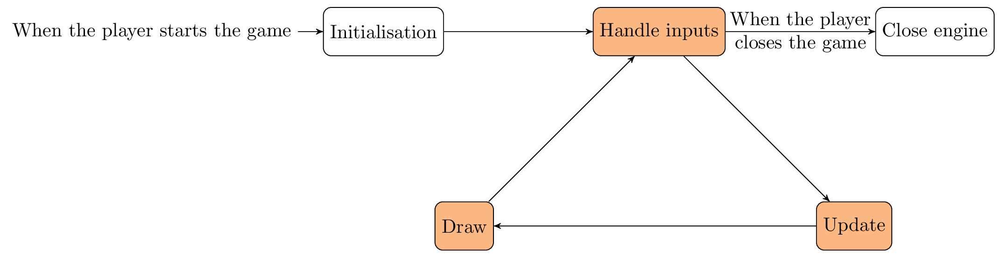

The game loop is the main loop of the engine.

As the following image shows, the engine performs the following actions:
  1. The engine is initialised when the program starts
  2. At each frame, the user inputs are handled, the different parts of the game are updated and the game is drawn on the screen
  3. When the player requests to close the game, the engine performs some cleaning operation and closes.

# Context and initialisation
The [Context]({{ "/documentation/alpha/c++/classengine_1_1Context.html" | relative_url}}) of the engine is a structure that contains a pointer to the different parts of the engine.
The very first action the engine does is initialising the Context.
The different parts of the context are created in this order:
  1. The File Manager (which also configures the Logger).
  2. The Texture Holder.
  3. The Font Holder.
  4. The State Manager.
  5. The Event Handler.
  6. The Input Handler.
  7. The Window.

The configuration of each part (if needed) is loaded from the `game.json` (at the root of the media folder). The following tutorials will explain the parts and how to configure them.

# The loop
We will know explain a little more the three steps of the main loop:
1. Inputs are processed by the following parts of the engine, in this order:
    1. The State Manager. Starting from the front state and until a non-transcendant state is reached, each state processes the input. The exact processing depends on the state.
    2. The Input Handler. At this point, it only stores the input
    3. Once every input is given to the input handler, it actually processes the inputs. For each registered input, it will trigger the corresponding event.
2. The State Manager is updated. Starting from the front state and until a non-transcendant state is reached, each state is updated. The exact update operations depend on the state.
3. The State Manager is drawn. Starting from the front state and until a non-transparent state is reached, each state is drawn. Again, the exact drawing operations depend on the state.

# The destruction
This step simply destroys the context and releases the resources.